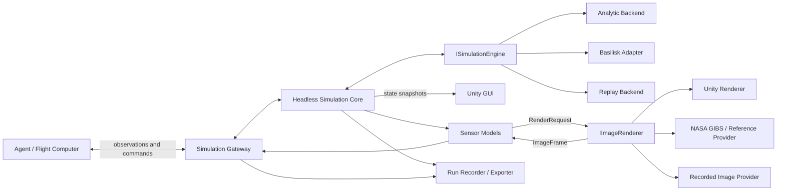

# Argus CubeSat Simulator — System Architecture

Status: foundational design and implementation baseline

## 1. Purpose

Argus is a CubeSat digital-twin platform for:

- deterministic agent training;
- software-in-the-loop (SIL) testing;
- hardware-in-the-loop (HIL) testing with a CubeSat flight computer;
- synthetic sensor and camera generation;
- interactive mission visualization and recorded-run replay.

The simulator must run without Unity. Unity is an optional GUI and image-rendering
adapter. A future dynamics backend such as Basilisk must be replaceable without
changing the GUI, agents, flight-hardware adapters, sensor contracts, or exporters.

## 2. Architectural principles

1. **The simulation core owns truth and time.** Unity frame time never advances the
   physical simulation.
2. **Unity is optional.** Closing the GUI must not stop a headless run.
3. **All boundaries use explicit contracts.** Units, coordinate frames, timestamps,
   validity, sequence numbers, and source identifiers are mandatory.
4. **Backends are replaceable.** Analytic development dynamics, Basilisk, recorded
   trajectories, and future engines implement the same interface.
5. **Controllers do not talk directly to Unity.** Agents and flight hardware exchange
   observations and commands through the simulation gateway.
6. **Pixels are renderer output, not dynamics truth.** The core specifies camera pose,
   timing, and calibration; Unity or another renderer produces image bytes.
7. **Training is deterministic by default.** Agent training uses lockstep `Reset` and
   `Step`; wall-clock HIL is a separate runtime mode.

## 3. Logical architecture



## 4. Component ownership

| Component | Owns | Must not own |
|---|---|---|
| Simulation core | simulation clock, run lifecycle, truth state, scheduling | Unity objects or rendering |
| Dynamics backend | orbit, attitude, forces, torques, actuator dynamics | GUI and transport protocols |
| Sensor models | cadence, calibration, noise, failures, standardized frames | controller logic |
| Simulation gateway | controller authority, validation, transport adapters, synchronization | orbital physics |
| Unity GUI | visualization, controls, interpolation, replay presentation | authoritative truth or clock |
| Image renderer | rasterization from a `RenderRequest` | camera scheduling or dynamics |
| Exporter | immutable run records and datasets | changing live state |

## 5. Closed-loop execution

### 5.1 Deterministic agent/SIL mode

1. The controller calls `Reset(seed, scenario)`.
2. The gateway returns the initial observation.
3. The controller submits an actuator command for the next sequence/time.
4. The core validates the command and advances a fixed interval.
5. Sensor models sample the resulting state.
6. The gateway returns the next observation and termination/status information.
7. Unity receives decimated snapshots independently and cannot block the loop.

This mode can run faster or slower than real time and is the default for training.

### 5.2 Hardware-in-the-loop mode

The same contracts are adapted to the flight computer's real interfaces, for example
Ethernet, UART, CAN, SPI, or I2C. The core runs against a monotonic wall-clock schedule.
Late, duplicate, or invalid commands are recorded and rejected according to policy.
Only one controller has actuator authority during a run.

### 5.3 Replay mode

Recorded snapshots, sensor frames, commands, and images are played back without an
active controller. Unity uses the same snapshot contract as a live run.

## 6. Core contracts

The first implementation lives in `Assets/ArgusSimulation/Core` and has no Unity
assembly dependency.

- `ISimulationEngine`: initializes, resets, and advances a replaceable backend.
- `SimulationConfiguration`: run ID, UTC epoch, and fixed simulation step.
- `SimulationStepInput`: target sequence/time plus actuator commands.
- `ActuatorCommandSet`: reaction-wheel torque, magnetorquer dipole, and thruster force
  in SI units and the spacecraft body frame.
- `SimulationSnapshot`: backend-neutral spacecraft truth and applied commands.
- `SimulationGateway`: deterministic in-process session and future transport boundary.
- `SensorFrame<TPayload>`: common envelope for simulated, physical, or replay sensors.
- `RenderRequest`, `CameraIntrinsics`, `ImageFrame`, and `IImageRenderer`: the
  renderer-neutral camera boundary.

External APIs must version serialized equivalents of these contracts rather than
serializing C# implementation types directly.

## 7. Coordinate frames, units, and time

The canonical internal unit system is SI.

- Position: meters.
- Velocity: meters per second.
- Angular rate: radians per second.
- Torque: newton-meters.
- Magnetic dipole: ampere-square-meters.
- Simulation time: monotonic seconds from the run epoch.
- External timestamps: UTC, with the simulation sequence retained.

Current truth state uses ECEF position/velocity and a body-to-ECEF quaternion. Every
future contract that adds ECI, LVLH, NED, camera, or sensor frames must name the frame
in the field or schema. Adapters perform conversions at boundaries; they must never
infer a frame from an unlabeled vector.

## 8. Sensor architecture

Each sensor consists of four separable responsibilities:

1. **Profile:** immutable hardware specifications and calibration.
2. **Mount:** location and orientation relative to the 1U body frame.
3. **Model:** sampling cadence, physics, noise, bias, quantization, and failures.
4. **Adapter:** simulated output, physical input, replay, transport, or export.

All sources publish the same `SensorFrame<TPayload>` envelope. This allows a run to
replace a simulated sensor with physical sensor input without changing consumers.

Planned hierarchy:

```text
SensorModel<TPayload>
├── ImuModel
├── MagnetometerModel
├── GpsModel
├── SunSensorModel
├── StarTrackerModel
├── PowerTelemetryModel
└── CameraModel
    ├── ArducamImx708CameraModel
    └── NadirGroundTruthCameraModel
```

The four physical cameras use one Arducam profile with different `+X`, `-X`, `+Y`, and
`-Y` mounts. They follow spacecraft attitude. The virtual ground-truth camera follows
spacecraft position but independently calculates a north-up nadir orientation.

## 9. Image rendering

Camera models own exposure timing, intrinsics, mounting, distortion, noise, and output
format. A renderer receives only a `RenderRequest` containing the camera pose,
calibration, resolution, and exposure time.

```text
Dynamics state
  -> camera pose/timing model
  -> RenderRequest
  -> Unity or alternate renderer
  -> raw rendered image
  -> camera-specific sensor effects
  -> ImageFrame
```

For GUI-only use, Unity may display its render texture locally. When an agent or flight
computer requires pixels, the renderer returns an `ImageFrame` for that exact simulation
sequence. A graphics-free run must explicitly select an alternate image provider or mark
the camera `Unavailable`; it must not silently return a black image.

NASA GIBS imagery is an Earth texture/reference source, not ground truth by itself.
Validation must retain capture time, footprint, camera calibration, and source imagery
metadata alongside each frame.

## 10. Unity integration

Unity consumes snapshots and commands for presentation. It may provide:

- Cesium/NASA GIBS mission visualization;
- spacecraft and deployable models;
- camera, star-field, depth, mask, and segmentation rendering;
- visibility/raycast visualization;
- telemetry panels and fault controls;
- scenario authoring and recorded-run replay.

Unity should normally render at 20–30 Hz while the dynamics and sensors run at their own
rates. The GUI interpolates presentation between snapshots. No Unity `MonoBehaviour`,
`GameObject`, `Transform`, or `RenderTexture` may appear in the core contracts.

## 11. Basilisk integration

`BasiliskEngine` will implement `ISimulationEngine` behind a Python process boundary.
It will translate Argus commands into Basilisk messages and translate Basilisk state and
sensor messages into Argus contracts. Basilisk becomes authoritative for simulation time
when selected.

Recommended topology:

```text
Argus gateway/orchestrator
    <-> generated gRPC/Protobuf contracts
Basilisk Python service
    <-> Basilisk processes, tasks, modules, and messages
```

Keep Argus extensions outside the Basilisk source tree. Do not expose Basilisk-specific
message classes to Unity, agents, or flight-hardware adapters. Mapping tests must cover
units, ECI/ECEF conversion, attitude convention, timestamp conversion, resets, and
command application.

## 12. Transport strategy

| Need | Preferred mechanism |
|---|---|
| Same-process agent training | direct `SimulationGateway` calls |
| Separate process / Basilisk | unary gRPC `Reset` and `Step` |
| Unity live state | decimated gRPC server stream or local IPC |
| HIL command/sensor traffic | bounded bidirectional gRPC or hardware protocol adapter |
| Lifecycle and run metadata | REST |
| Large images on one host | shared memory plus metadata message |
| Datasets and replay | versioned files/manifests |

REST is not part of the inner control loop. Protobuf schemas will be the cross-language
source of truth when the first out-of-process adapter is implemented.

## 13. Safety, validation, and observability

- Reject non-finite values, unknown frames/units, stale sequences, and wrong run IDs.
- Clamp or reject actuator commands according to an explicit hardware profile.
- Record requested and applied commands separately.
- Stamp every observation with run ID, sequence, simulation time, UTC, source, and status.
- Define controller heartbeat and failsafe behavior before connecting physical hardware.
- Keep physical actuators disconnected or inhibited during flight-computer HIL unless a
  dedicated test procedure explicitly enables them.
- Record backend version, scenario, random seed, camera profile, and calibration for
  reproducibility.

## 14. Repository direction

```text
Assets/ArgusSimulation/Core/Abstractions/  Replaceable service interfaces
Assets/ArgusSimulation/Core/Contracts/     State, command, and configuration DTOs
Assets/ArgusSimulation/Core/Dynamics/      Dynamics implementations
Assets/ArgusSimulation/Core/Imaging/       Camera and render contracts
Assets/ArgusSimulation/Core/Runtime/       Headless orchestration
Assets/ArgusSimulation/Core/Sensors/       Sensor contracts and models
Assets/ArgusSimulation/Unity/              GUI, Cesium, render, and runtime adapters
Assets/ArgusSimulation/Editor/Scene/       Scene/bootstrap tooling
Assets/ArgusSimulation/Tests/              Mirrored core and Unity tests
docs/                              Architecture and interface documentation

Future external packages/services:
Argus.Contracts/                   Protobuf schemas and generated clients
Argus.Basilisk/                    Python Basilisk adapter
Argus.Agent/                       Training environment/SDK
Argus.Hardware/                    Flight-computer protocol adapters
Argus.Export/                      Dataset and replay writers
```

## 15. Incremental implementation plan

### Foundation — in progress

- [x] Unity-independent core assembly.
- [x] Replaceable `ISimulationEngine` contract.
- [x] Analytic development backend.
- [x] Deterministic in-process `SimulationGateway`.
- [x] Standard sensor and image envelopes.
- [x] Renderer abstraction.
- [ ] Move mock sensor generation out of Unity.
- [ ] Implement camera base/profile classes and the Arducam IMX708 profile.

### Runtime separation

- [ ] Define versioned Protobuf schemas.
- [ ] Run the core in a standalone headless process.
- [ ] Add the Unity snapshot client and requested-frame renderer adapter.
- [ ] Add run recording and replay.

### Closed-loop integration

- [ ] Add the Python agent SDK with deterministic `Reset`/`Step`.
- [ ] Add command validation, authority, heartbeat, and failsafe policies.
- [ ] Add physical sensor/flight-computer adapters.

### High-fidelity backends

- [ ] Implement `BasiliskEngine` and mapping/contract tests.
- [ ] Validate the analytic and Basilisk trajectories against reference cases.
- [ ] Add synchronized camera rendering and NASA-image comparison metrics.

## 16. Current limitations

The analytic backend is only a deterministic integration fixture. It records actuator
commands but does not yet apply them to orbit or attitude. `MockSensorSuite` remains in
the Unity assembly and will be migrated behind sensor interfaces. Network transports,
Protobuf definitions, the Basilisk adapter, and physical hardware adapters are planned
but are not implemented yet.

## References

- [Basilisk repository](https://github.com/AVSLab/basilisk)
- [Basilisk simulation fundamentals](https://www.hanspeterschaub.info/basilisk/Learn/bskPrinciples.html)
- [gRPC core concepts](https://grpc.io/docs/what-is-grpc/core-concepts/)
- [Protocol Buffers overview](https://protobuf.dev/overview/)
- [Unity desktop headless mode](https://docs.unity3d.com/Manual/desktop-headless-mode.html)
