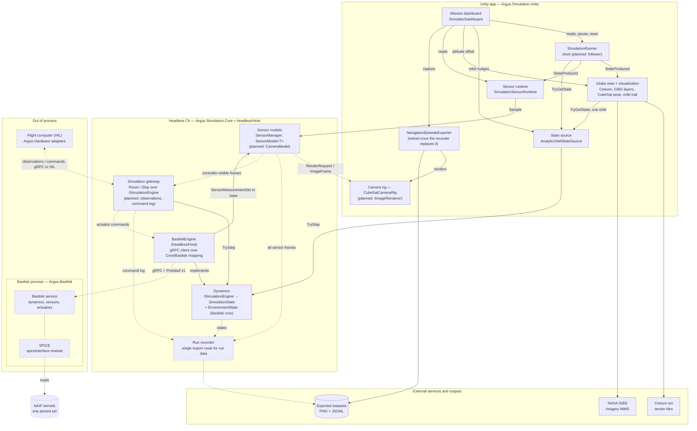
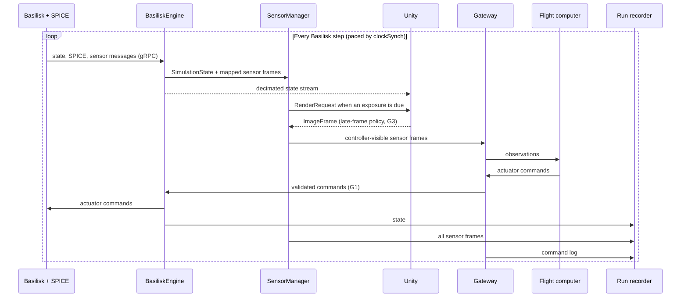

# Argus Simulator — Target Architecture

Status: agreed target design. Baseline: `main` at `7d3469d` (2026-09-29) plus the Phase 1
structure change that adds this document (§10).

This document records where the simulator is going, the decisions behind it, and the gaps
still open. [system-architecture.md](system-architecture.md) holds the original principles
and the current contracts; where the two differ, for example on who owns the clock in
Basilisk runs, the decisions here take precedence. [code-organization.md](code-organization.md)
is the authoritative class and folder map.

Legend used throughout: **main** means the code exists on `main`; **planned** means it
does not exist yet.

## 1. Block diagram

Solid boxes and arrows exist on `main`. Dashed boxes and arrows are planned; a solid box
with "(planned: …)" exists but gains that role later.



## 2. Blocks

| Block | Where | On `main` today | Target role | Status |
|---|---|---|---|---|
| Globe view + visualization | `Unity/Cesium/`, `Unity/Visualization/` | Cesium tileset, GIBS layers, globe camera, CubeSat pose, orbit trail; fixed Sun light | Sun light and night side follow the state's environment; orbit trail from state history | main (environment lighting planned) |
| Camera rig / renderer | `Unity/Cameras/` | `CubeSatCameraRig` renders 4 body cameras and a north-up nadir ground-truth camera every frame | Implements `IImageRenderer`: renders each `CameraModel` `RenderRequest` and returns an `ImageFrame` | main (renderer role planned) |
| SimulationRunner | `Unity/Runtime/SimulationRunner.cs` | The clock: fixed 0.1 s steps from Unity frame time × time scale | Follower: broadcasts states received from the headless core | main (follower planned) |
| State source | `Unity/Runtime/AnalyticOrbitStateSource.cs` | Wraps the analytic engine in the Unity process | Replaced by a state-stream client; `BasiliskEngine` runs in the headless core (G2). The analytic source stays for development | main (stream client planned) |
| Sensor runtime | `Unity/Sensors/` | Temporary bridge feeding each state to a Core `SensorManager` | Moves into the headless core (G2); Unity only displays frames | main (temporary) |
| Mission dashboard | `Unity/UI/` | Truth + sensor status, orbit and attitude nudges, GT imagery date, capture | Same, reading states; nudges become engine commands | main (state reading planned) |
| Navigation episode exporter | `Unity/Export/NavigationEpisodeExporter.cs` | Pauses the runner, renders the cameras, writes PNG + JSONL | Retired once the recorder covers what its consumers read (D6) | main (to retire) |
| Dynamics | `Core/Dynamics/`, `Core/Contracts/` | `AnalyticSimulationEngine` + `CircularOrbitModel`; the analytic engine reports no environment | `ISimulationEngine` returns a `SimulationState` with `EnvironmentState` in Basilisk runs; the analytic engine stays as a test fixture | main (contract done; producer planned) |
| Sensor models | `Core/Sensors/`, `Core/Sensors/Camera/` | `SensorManager`, `SensorModel<T>`, `IdealBodyRateSensorModel`; `BackendSensorModel<T>` with `ImuSensor`, `MagnetometerSensor`, `LightSensor` | Adds camera models; the backend sensors publish what `BasiliskEngine` maps from Basilisk sensors (D10) | main (cameras planned) |
| Simulation gateway | `Core/Runtime/SimulationGateway.cs` | Reset/Step over `ISimulationEngine`, forwarding commands; returns truth states; used by the tests (analytic engine) and by `headless/Host` (over `BasiliskEngine`) | Live link for agents and HIL: controller-visible sensor frames out, commands in, command log to the recorder | main (host and tests; observations planned) |
| BasiliskEngine | `headless/Host/Basilisk/`, `Core/Basilisk/` | gRPC client of the v1 Basilisk link over the internal Core mapping; unverified against a real service, which is a skeleton | Builds states from Basilisk state + SPICE; maps sensor messages; carries commands | main (client; service planned) |
| Run recorder | `Core/Recording/` | — | The single export route for run data: states, every `SensorFrame`, the gateway command log | planned |
| Argus contracts | `Argus.Contracts/` | v1 Basilisk link: `argus.sim.v1` (shared types, commands, P0 sensors, run configuration) and `argus.basilisk.v1` (`BasiliskSimulationService`) | Versioned Protobuf schemas for every cross-process message | main (Basilisk link; gateway, stream and renderer planned) |
| Basilisk service + SPICE | `Argus.Basilisk/` | Basilisk-free gRPC skeleton (every RPC UNIMPLEMENTED), pinned kernel manifest, implementation brief | Python service; dynamics, sensors, actuators; SPICE via `spiceInterface` | skeleton on main; Basilisk/SPICE team implements |
| Flight computer (HIL) | `Argus.Hardware/` | README placeholder | HIL hardware adapters talking to the gateway | planned |
| Headless build + host | `headless/` | Builds Core and runs the EditMode tests with `dotnet`; `headless/Host` runs the gateway and sensors over `BasiliskEngine` with a placeholder P0 scenario | Hosts the headless core process (G2): recorder, gateway server, Unity state stream | main (host skeleton) |

`Unity/Export/CesiumReferenceMapExporter.cs` is an offline tool that renders reference-map
tiles. It is not run data and sits outside D6.

## 3. Decisions

| # | Decision | Why | Consequence |
|---|---|---|---|
| D1 | The core is headless: `Argus.Simulation.Core` never references Unity. Unity is a client and a renderer. | Runs, training and HIL must work without the GUI. | The Core asmdef sets `noEngineReferences`, and `headless/` builds Core with plain `dotnet`. |
| D2 | Basilisk is the real dynamics backend and owns simulation time in every Basilisk run. In real-time and HIL runs it also owns pacing (`clockSynch`). | One authoritative clock. Live runs are never driven from an offline Basilisk recording. | Argus follows Basilisk's timestamps, and `SimulationRunner` becomes a follower. Replaying a recorded Argus run for review stays a separate planned mode ([system-architecture.md §5.3](system-architecture.md)). Whether lockstep training also uses Basilisk is open (§11). |
| D3 | SPICE runs inside Basilisk (`spiceInterface`). There is no separate SPICE service. | Basilisk and SPICE always run together, and a second SPICE source could drift from the one the dynamics used. | One pinned NAIF kernel set, loaded only by Basilisk. Tests use fixed environment tables instead of a second SPICE. |
| D4 | Environment data travels inside `SimulationState` as `EnvironmentState` (Sun vector, J2000 ↔ ITRF93 orientation, eclipse). There is no separate environment service. | It is per-step data produced together with the dynamics. | Lighting, camera models and the recorder read it through the state broadcast. |
| D5 | Cameras are Core sensor models. Unity only renders, through `IImageRenderer`. | Core owns exposure timing, pose and calibration, so camera frames share the run's timestamps. | A run that needs Unity-rendered images needs Unity with a GPU (batch mode is fine, `-nographics` is not). Other runs use another image source or mark cameras `Unavailable`; they never return black images. |
| D6 | One export route for run data: the run recorder, fed by states, all `SensorManager` output, and the gateway's command log. | One dataset format with the same run ID, sequence and timestamps for truth and every sensor. | `NavigationEpisodeExporter` is retired once the recorder covers what its consumers (the Python navigation code) read. |
| D7 | The gateway and the recorder are separate roles. The gateway never exposes truth. | The gateway is on the control loop's critical path; the recorder is a passive archive that must never block the loop. | The gateway forwards only controller-visible sensor frames (no ground-truth sensors) and returns observations, not `SimulationState`. The recorder receives everything, including the gateway's command log. |
| D8 | Unity never sees Basilisk-specific types. | Keeps the backend replaceable. | All Basilisk data enters through `BasiliskEngine` as Argus contracts. |
| D9 | The analytic engine stays as a development and test fixture. | Fast, deterministic tests without Basilisk. | It fills `SpacecraftState` tagged `AnalyticEarthFixed` (not ITRF93) and reports no `EnvironmentState`; it never approximates SPICE data (D3). Its circular orbit comes from its constructor. |
| D10 | Sensors that Basilisk models (IMU, magnetometer, light sensor) keep their physics and cadence in Basilisk. | One implementation of each sensor's physics, timed by the clock that owns the run (D2). | `BasiliskEngine` maps each step's Basilisk sensor messages into `SimulationState.SensorMeasurements`; a `BackendSensorModel<T>` publishes a frame exactly when its sensor was sampled and never computes, holds or repeats a value. |

## 4. Run modes

### Real-time Basilisk run (target)



### Lockstep run (agent training, target)

The controller calls `Reset(seed, scenario)` and then `Step(commands)` on the gateway, which
advances the engine by a fixed interval and returns observations. On `main`,
`SimulationGateway` already exposes `Initialize`, `Reset()` and `Step(commands)` over the
analytic engine in the tests and over `BasiliskEngine` in `headless/Host`, but it returns
truth `SimulationState`s.
`Reset(seed, scenario)` and observation-only returns are planned (§5, D7). Whether Basilisk
also runs lockstep (faster than real time, paced by the caller) is an open question (§11).

### Analytic development run (what `main` does today)

1. `SimulationRunner` accumulates Unity frame time and steps every 0.1 s.
2. `AnalyticOrbitStateSource.TryGetState` calls `AnalyticSimulationEngine.TryStep`, which
   samples `CircularOrbitModel`. It always sends `ActuatorCommandSet.None`.
3. The runner raises `StateProduced`. `CesiumSpacecraftPoseDriver` moves the CubeSat and
   `SimulationSensorRuntime` samples the Core sensors.
4. `OrbitTrailRenderer` samples the state source directly for one orbit period.
   `SimulatorDashboard` polls the runner and the sensor runtime, and writes orbit and
   attitude nudges straight into the state source and pose driver.

## 5. Contract changes needed

| Contract | File | Change | For | Status |
|---|---|---|---|---|
| `SimulationState` | `Core/Contracts/SimulationState.cs` | Optional `EnvironmentState`, present exactly when the state is ITRF93; `SensorMeasurements` | D4, D10 | done |
| `EnvironmentState` | `Core/Contracts/EnvironmentState.cs` | Sun position, J2000 → ITRF93 rotation and Earth rate, spacecraft shadow factor | D4 | done |
| `SpacecraftState` | `Core/Contracts/SpacecraftState.cs` | `EarthFixedFrame` tag (`Core/Contracts/ReferenceFrame.cs`) | G4 | done |
| `SimulationConfiguration` | `Core/Contracts/SimulationConfiguration.cs` | Optional orbit (`ClassicalOrbitElements`), spacecraft (`SpacecraftConfiguration`), seed, kernel-set ID and sensors (`SensorConfiguration`) | G5 | done |
| `SensorSampleContext` | `Core/Sensors/SensorContexts.cs` | `(runId, state)` exposes `Measurements`; `Environment` is added with its first consumer (cameras, lighting) | D4, D10 | done (environment planned) |
| `SensorMeasurementSet` | `Core/Sensors/SensorMeasurementSet.cs` | Backend measurements of one step, keyed by sensor ID; keeps "not sampled" apart from "sampled but unavailable" | D10 | done |
| P0 sensors | `Core/Sensors/ImuSensor.cs`, `MagnetometerSensor.cs`, `LightSensor.cs` | `BackendSensorModel<T>` subclasses built by `SensorFactory` from `SensorConfiguration` | D10 | done |
| `SensorDefinition` | `Core/Sensors/SensorDefinition.cs` | Mark ground-truth sensors as not controller-visible | D7 | planned |
| `SimulationRunner.StateProduced` | `Unity/Runtime/SimulationRunner.cs` | Publish the whole `SimulationState` | D2, D4 | planned |
| `ISpacecraftStateSource` | `Core/Abstractions/ISpacecraftStateSource.cs` | Replace with `ISimulationStateSource`, which carries the whole state | D2, G2 | planned |
| `RenderRequest` / `IImageRenderer` | `Core/Imaging/`, `Core/Abstractions/` | Add the Sun direction; add a Unity implementation | D5 | planned |
| `SimulationGateway` | `Core/Runtime/SimulationGateway.cs` | Step returns observations (controller-visible frames), not `SimulationState`; command log; `Reset(seed, scenario)`; authority and heartbeat | D7, G1 | planned |
| Actuator commands | `Core/Contracts/ActuatorCommandSet.cs` → `BasiliskEngine` | An engine that applies them | G1 | planned |

## 6. Frames, units and time

- Internal units stay SI (see [system-architecture.md §7](system-architecture.md)).
- `SpacecraftState` stays canonical Earth-fixed with a body-to-ECEF quaternion.
  `EarthFixedFrame` names the frame: `Itrf93` in Basilisk runs, `AnalyticEarthFixed` for the
  analytic fixture (z is the spin axis at a constant 7.2921150e-5 rad/s, x is the fixture's
  inertial x at the epoch; never converted with SPICE data). A `SimulationState` rejects
  `Unspecified`, and carries `EnvironmentState` exactly when the frame is `Itrf93`.
- `AngularVelocityBodyRadiansPerSecond` is the body rate relative to inertial, in body axes
  (Basilisk `omega_BN_B`).
- Basilisk works in J2000 with MRP attitude σ_BN. `BasiliskEngine` converts at the boundary
  with SPICE's J2000 → ITRF93 rotation `q_EN`: `BodyToEcef = q_EN * q_NB`, where `q_NB` is
  σ_BN as a quaternion.
- In Basilisk runs, Basilisk's simulation time is authoritative. UTC is derived from the
  run epoch. Every cross-process field names its frame, unit and time scale.

## 7. Gaps

| # | Gap | Notes |
|---|---|---|
| G1 | No backend applies actuator commands | `SimulationGateway.Step` already forwards `ActuatorCommandSet` to `ISimulationEngine.TryStep`, but `AnalyticSimulationEngine` only records it in the state. The gateway already rejects non-finite commands and commands for the wrong sequence or time, and checks each engine state's run ID, sequence and time; hardware-limit validation (clamp or reject per actuator profile), authority and heartbeat are still missing. The Unity runner path bypasses the gateway and always sends `ActuatorCommandSet.None`. |
| G2 | The core runs inside Unity | Target: a headless core process owning the gateway, `BasiliskEngine`, sensors and recorder. Unity becomes a client of a decimated state stream. |
| G3 | Camera timing in real time | A Cesium render can take longer than a step. Needs a late-frame policy: stamp with capture time, drop, or mark stale. |
| G4 | Frame and unit mapping | Basilisk inertial frame + MRP vs `SpacecraftState` ECEF + quaternion. Frame tags, `Core/Basilisk/BasiliskStateMapper` and its tests exist; `BasiliskEngine` in `headless/Host` calls them. None of it has run against a real Basilisk service yet. |
| G5 | One shared run configuration | Epoch, orbit, kernel-set ID, seed and sensor profiles defined once and shared by Basilisk and Argus; only Basilisk loads the kernels. Defined in Core as `SimulationConfiguration`; `KernelSetId` names `Argus.Basilisk/kernel_sets/<id>.json`. |

**Not built yet:** the Basilisk service behind the v1 schemas (it is a skeleton, so
`BasiliskEngine` is unverified against real Basilisk); camera models; the upcoming sensor models (GNSS, fine Sun sensor, star tracker, power,
thermal, radio, radiation: placeholders only, Basilisk or Argus source still open);
the run recorder, dataset format and replay of recorded runs; gateway safety (authority,
hardware-limit validation, heartbeat, failsafe); kernel loading (manifests are in
`Argus.Basilisk/kernel_sets/`).

**Known issues on `main`:**

- The east night-lights overlay uses material key `"3"`
  (the east night overlay in `Unity/Cesium/NasaGibsRasterController.cs`), but the default Cesium tileset
  material only has overlay slots `0`, `1` and `2`, so that overlay is never drawn. The part
  of the night side past the antimeridian (about 180° to 145°W with the fixed Sun) shows no
  city lights.
- The night-side longitude is computed from the Sun direction in the georeference's local
  East-Up-North frame (`NasaGibsRasterController.cs`, night-side longitude) instead of Earth-fixed
  coordinates. With the scene's origin near Denver, the night-lights band sits about 20°
  away from the true night side.
- The scene's Sun light is fixed.
- The dated GIBS day layer comes from a single date, and no date has daylight imagery at
  both poles.
- Attitude nudges change what the cameras render but not the recorded `BodyToEcef`, so
  exported images can disagree with the exported attitude.

## 8. Teammate branches that diverge from these decisions

These branches are not on `main`. They need to be reconciled with the decisions above
before they merge.

- `spice-integration` (and the local `spice-unity-presentation` ref) generate SPICE
  environment tables offline with `Argus.Spice/generate_reference.py`, and Unity loads
  them at runtime. `runtime-spice-integration` (merged into `origin/spice-unity-presentation`
  as PR #11) runs a persistent Python SPICE worker (`runtime_service.py`). Both add a
  SPICE source outside Basilisk, which conflicts with D3. Both also add a separate
  ephemeris provider (`IEphemerisProvider` in `Core/Abstractions/`, `EphemerisSample` and
  `SunObservation` in `Core/Contracts/`, implementations in `Core/Environment/`) instead of
  `EnvironmentState` in the state, which conflicts with D4.
- `basilisk-integration` replays an offline Basilisk recording from `dynamics/basilisk/`.
  This conflicts with D2. Its Unity `BasiliskReplayStateSource` also parses Basilisk output
  inside Unity and supplies gyro measurements outside `BasiliskEngine` and the Core sensor
  models, which conflicts with D8. It is also based on a `main` from before the sensor PRs.
  Its Basilisk work belongs in `Argus.Basilisk/`.

## 9. Code layout

The authoritative map is [code-organization.md](code-organization.md). In short:

```text
Assets/ArgusSimulation/
├── Core/                  Headless C# (noEngineReferences)
│   ├── Abstractions/      Engine, state-source and renderer interfaces        main
│   ├── Basilisk/          Internal Basilisk-to-Argus mapping                  main
│   ├── Contracts/         Simulation state, commands, configuration           main
│   ├── Dynamics/          Analytic engine (test fixture)                      main
│   ├── Imaging/           Camera and render contracts, GIBS URLs              main
│   ├── Math/              Vectors, quaternions, MRPs, 3x3 matrices            main
│   ├── Recording/         Run recorder                                        placeholder
│   ├── Runtime/           Simulation gateway                                  main
│   └── Sensors/           Sensor models; Camera/ and upcoming sensors placeholders   main
├── Unity/                 Cameras, Cesium, Export, Runtime, Sensors, UI, Visualization   main
├── Editor/Scene/          Scene builder                                       main
└── Tests/                 EditMode (Core only), PlayMode (Unity)              main
headless/                  dotnet build of Core + EditMode tests; Host/        main
Argus.Contracts/           Protobuf schemas (v1 Basilisk link)                 main
Argus.Basilisk/            Basilisk service with SPICE                         skeleton + brief
Argus.Hardware/            HIL adapters                                        planned (README)
```

## 10. Roadmap

**Phase 1: structure (no behaviour change)**

- [x] This document, linked from the README and both existing docs.
- [x] Core asmdef enforces `noEngineReferences`; `headless/` builds Core and runs the
      EditMode tests with `dotnet test`.
- [x] Planned folders carry ownership READMEs (`Core/Recording/`, `Core/Basilisk/`,
      `Core/Sensors/Camera/`, `Argus.Contracts/`, `Argus.Basilisk/`), and so does the
      existing temporary `Unity/Sensors/` bridge.

**Phase 2: contract seams (one PR each)**

- [x] Frame tags, MRP → quaternion math (quaternion → MRP is `EP2MRP` in the service), and
      the shared run configuration (G4, G5).
- [x] `EnvironmentState` in the `SimulationState` and the full state in `SensorSampleContext`
      (D4).
- [x] P0 sensor contracts (IMU, magnetometer, light sensor) and backend-sourced sensor
      models fed by `SimulationState.SensorMeasurements` (D10).
- [x] Internal Basilisk-to-Argus mapping with frame tests (G4).
- [ ] The runner publishes whole states; the Unity Sun light and night side follow
      `EnvironmentState`. Fix the night-lights key `"3"` separately.
- [ ] Camera models with a late-frame policy, and a Unity `IImageRenderer` (D5, G3).
- [ ] Run recorder v0, the gateway command log, and controller-visible observations
      (D6, D7).

**Phase 3: engine, process split and cleanup**

- [ ] Retire `NavigationEpisodeExporter`: point Capture at the recorder, then remove it from
      the scene, the scene builder and the tests in one change.
- [ ] Follower runner: replace `ISpacecraftStateSource` with `ISimulationStateSource`; build the
      orbit trail from state history.
- [x] Protobuf v1 for the Basilisk link in `Argus.Contracts/`.
- [ ] `Argus.Basilisk/` service with SPICE (skeleton, kernel manifest and implementation
      brief on main; the Basilisk/SPICE team implements it).
- [x] `BasiliskEngine` gRPC client and the headless host (`headless/Host`).
- [ ] The headless core process serving the recorder, the gateway and the Unity stream
      (G1, G2). Port teammate Basilisk and SPICE work into this layout per §8.
- [ ] Orbit and attitude nudges become engine commands, so rendered images match the
      recorded state.

Beyond Phase 3: the HIL adapters (`Argus.Hardware/`) against
the gateway.

## 11. Open questions

- Does lockstep agent training run Basilisk faster than real time, or only the analytic
  fixture? (D2) The service supports `real_time_factor` 0 (unpaced); whether training uses
  it stays open.
- Must dataset v1 stay compatible with `NavigationEpisodeExporter`'s current output for the
  Python navigation code? (D6)
- Does `SpacecraftState` stay canonical ITRF93 with conversion only at the Basilisk
  boundary, or also carry inertial fields? (G4) Proposed: canonical Earth-fixed plus the
  frame tag; inertial quantities are recoverable from `EnvironmentState` (q and ω).
- Where does the gRPC client for `BasiliskEngine` live? (D1) Answered on `main`:
  `headless/Host`, with internal generated code, over the internal `Core/Basilisk`
  mapping, so Core never references Protobuf or gRPC.
- Gateway ordering: today `Step(k)` carries command k and returns state k, so command k
  cannot be computed from observation k. The closed loop in system-architecture §5.1
  (Reset → observation 0, Step(command k) → observation k+1) needs an `ISimulationEngine`
  and gateway change; the v1 wire can stay as it is. (D7, G1)
